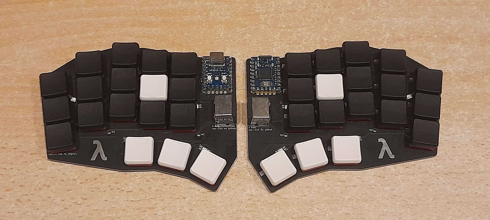
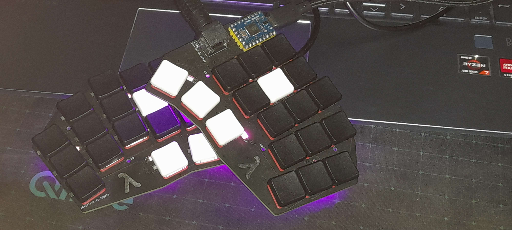
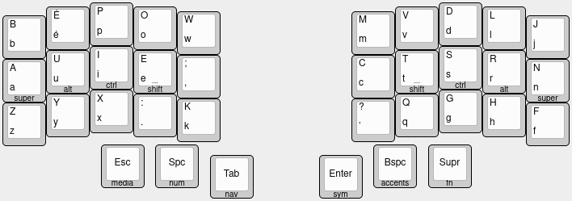

# Lambda keyboard

A custom 36-key wired ChocV1 split keyboard.

> Note : this keyboard is my first design, and while taking it as an inspiration
> can be a good idea, please think before building exactly this design : there
> are a few flaws that I wrote about below.

# Building the keyboard

## Components

To build the keyboard, you'll need :
- 2 RP2040-Zero micro controllers
- 2 4-pin mini DIN connectors
- 5 YS-SK6812mini-e LEDs *(optional, the keyboard will work without them)*
- 36 Kailh hot-swappable sockets
- 36 **Choc v1** (and not Choc v2 !!) switches
- 36 **Choc v1** keycaps

The keyboard is diode-less !

You can also design your own case, but I did not bother.

## Price

Ordering everything in France, including soldering tools, it cost about 110 €,
where approximately a third was for electrical components and the PCB, a second
third for key caps and switches, and the last third for shipping costs.

## Firmware

This repo also contains QMK firmware for this keyboard, using the BÉPO french
layout. The keyboard layout was inspired by
[Miryoku](https://github.com/manna-harbour/miryoku), and you can view it on
[keyboard-layout-editor.com](https://www.keyboard-layout-editor.com/#/gists/44301debdf501308d3bc676f406fde57).

# About the project

## Why design yet another split keyboard ?

I fell into the rabbit hole of custom split keyboards, and with all the summer
holidays in front of me, I couldn't hold back. It was a fun project !

I chose to make my own design because none where satisfying all my requirements,
which were :
- Exactly 36 keys, I was afraid to go with only two thumb keys, but still wanted
  to go with few keys.
- A layout with enough stagger for my pinky.

With enough research I maybe could have found something, but designing it myself
was far more interesting. 

If you want a split keyboard, you can definitely think
about creating your own ! It is not as difficult as it would seem, and this
journey is well documented and there are a lot of tools to make your life
easier.

## Why lambda ?

I like this Greek letter, and my name starts with an L.

## Inspirations 

- the [Corne keyboard](https://github.com/foostan/crkbd) and the 
  [TOTEM keyboard](https://github.com/GEIGEIGEIST/TOTEM) for the layout (among 
  others)
- [axhixh/mini-kbd](https://github.com/axhixh/mini-kbd/tree/main) which helped
  me a lot to figure out the PCB design.

## What would I change ?

As my first design, nothing is perfect, and here are some things I would change
for a future design.

### An other connector

I like that the mini DIN protects my keyboard from shorting, but the cable is
really bulky. I'll think about changing to USB C next time.

### 4 rows instead of 3 to make writing french accents easier.

Writing in English is not a problem, but in french with accents everywhere I
find it painful to constantly use layers. It is possible and can even become
reliable, but for now I couldn't really get used to it (maybe I haven't used the
keyboard enough yet...).

Also, for coding, where a lot of special symbols are needed, a couple more keys
could be useful.

### More leds

Only 5 underglow LEDs are not enough in my opinion, you can see their light but
there are some "holes". Also, for a future keyboard I'd like per key lighting as
well, even if it requires more work.

### An OLED display

Seems fun.

### Writing JLCJLCJLC on the PCB

Without this text, JLC PCB wrote a random number in a random place on my PCBs...
Fortunately it does not look that bad.

